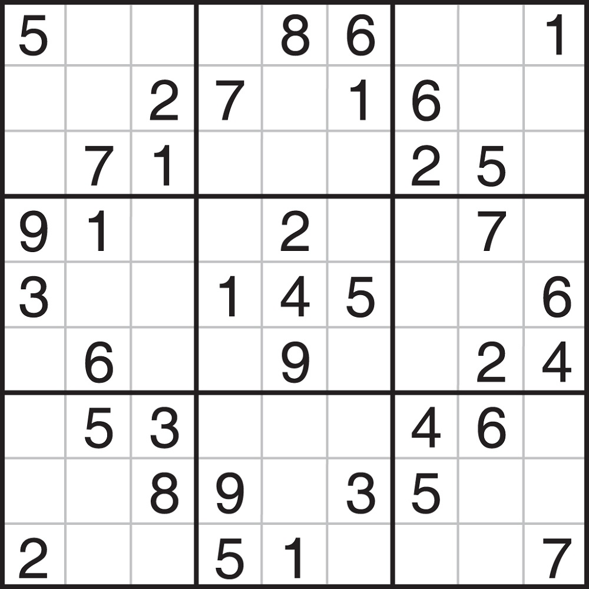
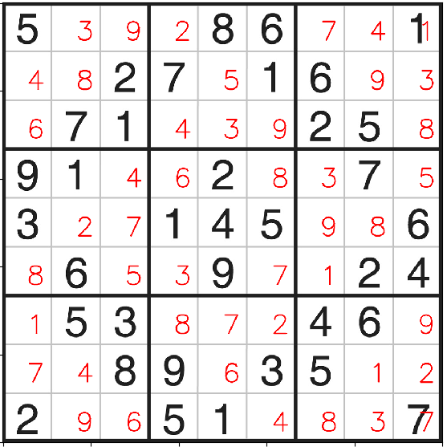

# Sudoku-Solver
I tried to understand and implement a sudoku solver with the help of code written and explained by @Aakash Jawar. Link: https://medium.com/@aakashjhawar/sudoku-solver-using-opencv-and-dl-part-1-490f08701179
## Procedure:
The Procedure involves two main parts. 
*  Preprocess the Image and Extract the puzzle
*  Solve and Display
### Preprocessing the image:
The image is performed with Gaussian blur and Adaptive Thresholding. Now the resultant binary image is fed into a dilation unit for better results in later events.
The contours are detected and the contour with largest area is expected to be the puzzle's boundary. <br><br>Now skewing is applied in case of distorted image. After this, the puzzle boundary coordinates are used to find the length of each of the 81 identical cells in the puzzle. Their coordinates are all found and added to a list in row by row fashion.
<br>


<br>
### Extract the puzzle:
Now, these portions are fed into pytesseract's image_to_string function one by one and the numbers are predicted. The empty cells are conditioned to return 0. They are then reshaped into [9,9] size and fed into the solving module. So the matrix of sudoku puzzle looks as follows.
<br>```
[[5 0 0 0 8 6 0 0 0]
[0 0 2 7 0 1 6 0 0]
[0 7 1 0 0 0 2 5 0]
[9 1 0 0 2 0 0 7 0]
[3 0 0 1 4 5 0 0 6]
[0 6 0 0 9 0 0 2 4]
[0 5 3 0 0 0 4 6 0]
[0 0 8 9 0 3 5 0 0]
[2 0 0 5 1 0 0 0 0]]```
 <br>
 ### Solve and Display:
 The solution part ia a recursive function where we replace each zero with numbers from range(1,10) and check if it fits such that it doesnt appear in the same column or row or sub-square. This is done with the following function.
 <br>
 ```python
 def fits(n,r,c):
    for i in range(0,SIZE):
        if matrix[r][i]==n:
            return False
    for i in range(0,SIZE):
        if matrix[i][c]==n:
            return False
    row_start = (r//3)*3
    col_start = (c//3)*3
    for i in range(row_start,row_start+3):
        for j in range(col_start,col_start+3):
            if matrix[i][j]==n:
                return False
    return True

def solve():
    row=0
    col=0
    a=next_unsolved_cell(row,col)
    if a[2]==0:
        return True
    row=a[0]
    col=a[1]
    for i in range(1,10):
        if fits(i,row,col):
             matrix[row][col]=i
             if solve():
                 return True
             matrix[row][col]=0
    return False
```
<br>
Once the solve function returns true, the numbers are written on the image with the help of the coordinates from Extract_Sudoku module and putText function from cv2 library.

<br>
Error: The pytesseract has detected 1 and 7 in [0,8] and [8,8] position wrongly, hence it should have been replaced by 0s which is why they appear overwritten in the output image. 
